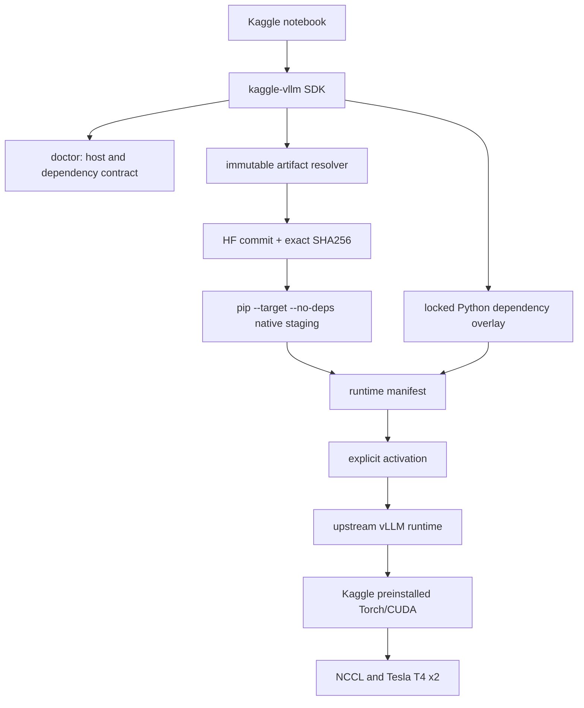

# Architecture and design rationale

Kaggle controls Python, PyTorch, the CUDA-facing runtime, driver mounts, base
Python packages and an ephemeral notebook filesystem. Native vLLM wheels are
tightly coupled to those layers. A normal `pip install vllm` may resolve a
different Torch/CUDA dependency set and disturb a working managed image.

`kaggle-vllm` therefore treats delivery as an explicit compatibility operation:

## Boundary of responsibility

The SDK owns profile validation, immutable resolution, streaming checksum
verification, safe cache/destination handling, staging plans, manifest-owned
reset, activation and thin convenience wrappers. It does not own or implement
vLLM kernels, model execution, scheduling, tensor parallelism, sharded-state
persistence or the OpenAI-compatible API.

## Why each constraint exists

- Immutable Hugging Face revision plus SHA256 prevents mutable-ref drift and
  detects byte changes.
- `--target --no-deps` keeps the native wheel out of system site-packages and
  prevents pip from replacing Kaggle Torch.
- A separate locked overlay fills known base-image gaps without declaring
  Torch, CUDA or vLLM as SDK dependencies.
- Explicit activation confines `PYTHONPATH`, `PATH` and `LD_LIBRARY_PATH`
  changes to the selected process or shell.
- A manifest records artifact identity, resolved paths and environment. Reset
  is allowed only for defaults or custom resources proven by that manifest.
- Large CUDA/model artifacts stay on Hugging Face rather than PyPI or Git.

The one lightweight runtime dependency, `packaging`, is used only for correct
PEP 440 dependency checks. Installing the SDK still does not pull vLLM, Torch
or CUDA packages.

## Extension points

Profiles are packaged under `src/kaggle_vllm/profiles/<profile>/`. Each profile
contains its native identity, overlay requirements/lock and dependency
baseline. This structure permits future profiles without weakening the only
current strong claim: Kaggle T4x2, cp312, cu128. New hardware profiles require
their own real acceptance evidence.
