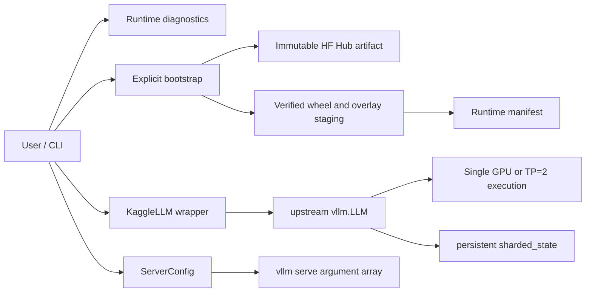

# Architecture

`kaggle-vllm` keeps policy and diagnostics separate from upstream execution.

The package does not import vLLM for diagnostics, install anything at import
time, implement kernels, replace schedulers, or reproduce vLLM inference.

## Modules

- `environment` collects a secret-free runtime fingerprint using lazy Torch
  discovery.
- `runtime` validates visible GPU count, Tesla T4 identity, SM75, and TP degree.
- `doctor` compares the runtime with the exact validated profile.
- `checksums` streams large-file SHA256 calculations.
- `installation` performs opt-in wheel/overlay staging while blocking Torch in
  overlay requirements.
- `profiles` loads the packaged immutable native-runtime and overlay identity.
- `download` uses Hugging Face Hub/Xet when available and a pinned HTTPS
  fallback, requiring the expected SHA256 in both cases.
- `bootstrap` validates the host, stages both targets, writes the runtime
  manifest, and provides explicit process/shell activation.
- `llm` supplies conservative defaults and delegates to upstream `vllm.LLM`.
- `sharding` delegates saving and inspects rank/part topology without loading
  safetensor bodies.
- `server` builds and executes an argument array for upstream `vllm serve`.
- `cli` exposes the small operational surface.

The SDK is lightweight (`dependencies = []`). Optional Hugging Face Hub support
does not make vLLM, Torch, CUDA, or NCCL package dependencies. Native runtime
installation is a separate, explicit bootstrap operation because ordinary
dependency resolution would defeat the compatibility strategy.
